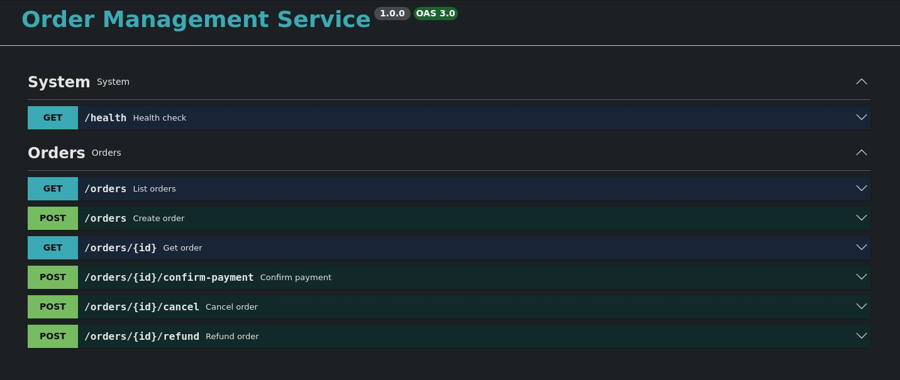

# Order Management Service (Symfony)

Order Management Service built with **PHP 8.3+** and **Symfony 7**.

The service is designed around production constraints:

- Layered architecture (DDD-lite)
- Explicit domain invariants and state transitions
- Idempotent command handling for critical operations
- Async processing with retries
- Structured logging + correlation IDs
- Health checks
- Strong quality gates (tests + static analysis)

## Domain

`Order` is modeled as an aggregate with strict invariants.

- **Statuses**
  - `created`
  - `paid`
  - `cancelled`
  - `refunded`
  - `fulfilled`
- **State machine**
  - Transitions are validated; illegal transitions fail fast.

## HTTP API

- `POST /orders`
- `GET /orders/{id}`
- `GET /orders` (pagination + filtering)
- `POST /orders/{id}/confirm-payment` (idempotent)
- `POST /orders/{id}/cancel`
- `POST /orders/{id}/refund`
- `GET /health`

### OpenAPI / Swagger

- Swagger UI: `http://localhost:8080/api/docs/`
- OpenAPI JSON: `http://localhost:8080/api/docs.json`



## Local run (Docker)

```bash
docker compose up --build
```

- `nginx`: `http://localhost:8080`
- `postgres`: `localhost:5432`
- `redis`: `localhost:6379`

## Code organization

- `src/Domain` — aggregates, value objects, domain exceptions
- `src/Application` — use cases + DTOs, framework-agnostic
- `src/Infrastructure` — DB/Redis/queue implementations
- `src/Interfaces` — HTTP controllers, validation, response mapping

## Milestones

1. Baseline scaffold (Symfony + Docker)
2. Layer boundaries + core interfaces
3. Order domain model + unit tests
4. Use cases (Create/Confirm/Cancel/Refund/Get/List)
5. PostgreSQL persistence (Doctrine mappings + migrations)
6. HTTP API + unified error format + pagination/filtering
7. Idempotency storage and behavior
8. Messenger async processing + retry strategy
9. Observability (JSON logs, request IDs) + health checks
10. OpenAPI spec (`openapi/`)
11. PHPUnit + API integration tests + PHPStan max level
12. Engineering docs (ADRs + failure scenarios + security/testing notes)

## License

All rights reserved.
